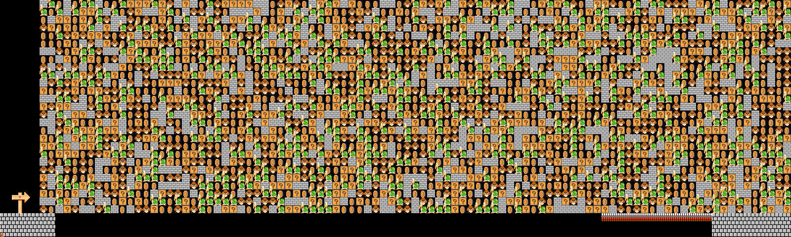
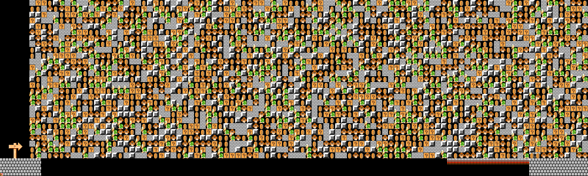
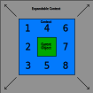
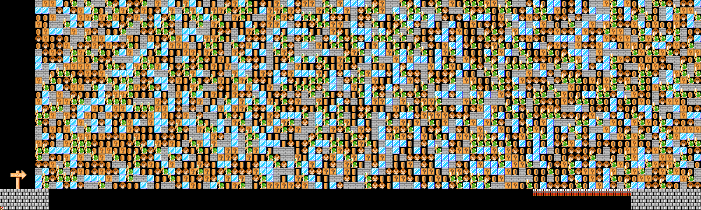
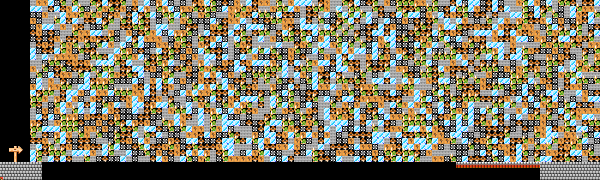

# MarioDiffusion

Generating SMM2 levels using a diffusion inspired approach.

*7x7, no limit, no air, 5000 levels, width 100, height 30, iterations 30, air probability 0.85, allowed objects [4, 5, 8]*

*7x7, no limit, no air, 5000 levels, width 100, height 30, iterations 30, air probability 0.85, allowed objects [4, 5, 6, 8]*


# Model
The model is a neural network with an input of *i* neurons, where *i* is the number of possible object IDs, times *j*, where *j* is the number of adjacent objects to include in the training data. The output is a probability distribution of *i* object ID neurons, where the one with the best probability that has an ID within the allowable range is chosen. The number of adjacent objects to train on is configurable and is called the context size in this model. The visual below demonstrates how a context size of 3 is trained, where 3 represents the *3x3* square surrounding the object ID the model is trying to output.




# Training
```bash
cd train
python train.py
```
Uses Huggingface [TheGreatRambler/mm2_level](https://huggingface.co/datasets/TheGreatRambler/mm2_level). Training variables are defined at the top of the file. Context size controls the amount of adjacent blocks trained on. Object limit is a method of smoothing the number of samples trained on each object, it did not produce better results for me. Including air allows for training on air, or no object at all, it did not produce better results for me. Number of levels does not need to be set past a few thousand to produce acceptable results.

# Inference Idea
The theory behind inference in this model comes from a background in cellular automata, where decisions about the next state are made by nearby objects. This approach was applied to Mario Maker 2 by training on a configurable context size of adjacent objects and learning what the expected middle object should be. The level starts as random noise of all allowable objects and this inference is performed for every object in the level, where a context that stretches off the side of the level is considered to be air. This is called one iteration. The same process is performed again on the objects generated by the last iteration until *n* interations has been reached. This approach is a blend of cellular automata and diffusion.

This approach inevitably began to prioritize not the objects that actually fit a specific circumstance but instead the objects that just appeared the most. Multiple iterations would not improve the output but just cause a small number of the allowed objects to crowd out all other potential objects. An approach I experimented with was limiting the number of samples per object so that the same number of samples per object was included but this did not fix the overcrowding, it just led to rarer objects becoming dominant instead.

Further research would be into a transformer approach, perhaps by going in a zigzag across the level or maybe through some 2d inference rather than linear. Another approach is a GAN paired with a diffusion model, the same approach used by modern image generators. Diffusion models however operate on continuous data. I welcome any recommendations to overcome this limitation.

# Inference Code
## MacOS M1
```bash
go run -ldflags="-r ." .
```
## Windows
```bash
go run .
```

**Support for other platforms is welcome**

The MarioEdit library is neccesary to render images. Library is located at [TheGreatRambler/MarioEdit](https://github.com/theGreatRambler/marioedit) but because it is difficult to build a built version is in this repo for M1 Mac and Windows. Assets and headers for MarioEdit are provided by a git submodule but it does not need to be recursively downloaded unless you plan on building it. This also uses the Tensorflow C API through the Go API, installation my vary by platform.

## Benchmarks
* 100 by 30 on 3x3: 50.6225ms per iteration on M1 Mac
* 100 by 30 on 5x5: 147.326417ms per iteration on M1 Mac
* 100 by 30 on 7x7: 432.857584ms per iteration on M1 Mac

## Variables
* If you trained with *include_air = True* make sure to set *INCLUDE_AIR* to *true*.
* Set *MODEL_NAME* and *MODEL_CONTEXT_SIZE* to the values set during training.
* *WIDTH* and *HEIGHT* are the dimensions, in blocks, of the generated level.
* *ITERATIONS* is the number of fake diffusion iterations to perform.
* If the highest probability valid object returned by the model is less than *AIR_PROBABILITY* the object is instead set to air or no object.
* *BCD_FILENAME* can be used to save the generated level to a file.

# More examples
*5x5, no limit, no air, 5000 levels, width 100, height 30, iterations 12, air probability 0.85, allowed objects [0, 1, 4, 5, 8]*

*5x5, no limit, no air, 5000 levels, width 100, height 30, iterations 3, air probability 0.95, allowed objects [0, 1, 4, 5, 8, 63]*

*3x3, no limit, no air, 5000 levels, width 100, height 30, iterations 30, air probability 0.987, allowed objects [0, 1, 4, 5, 43, 63]*
